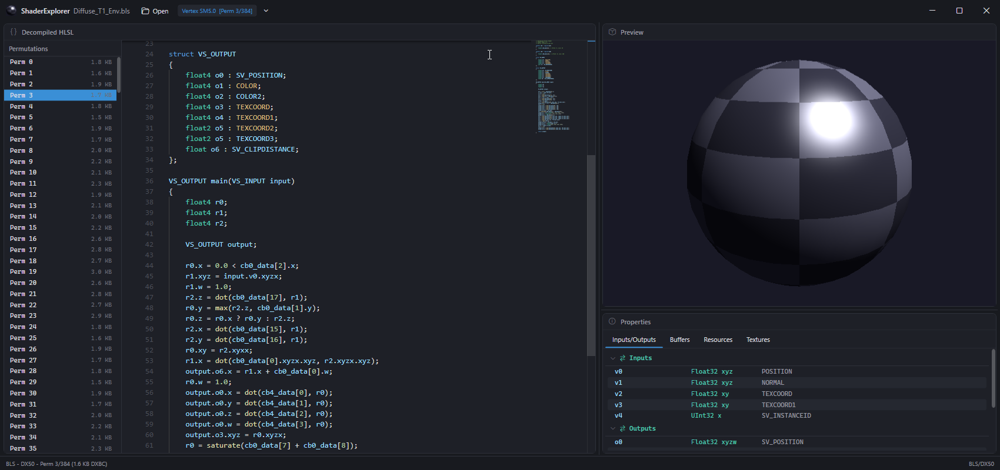

# ShaderExplorer

GPU shader decompiler and inspector with integrated 3D preview. Converts compiled shader bytecode into readable HLSL or Metal source code.



## Supported Formats

| Format | Extensions | Description |
|--------|-----------|-------------|
| DXBC | `.cso`, `.dxbc`, `.fxo` | DirectX Bytecode (SM5 and earlier) |
| DXIL | `.dxil` | DirectX Intermediate Language (SM6+) |
| BLS | `.bls` | Blizzard shader container (DXBC, DXIL, Metal variants) |
| MetalLib | `.mtllib`, `.mtl` | Apple Metal compiled library |
| Metal Source | `.mtl` | Metal shading language source |

## Features

- **Decompilation** — DXBC/DXIL to HLSL, Metal AIR to MSL
- **Monaco Editor** — Syntax-highlighted code view with variable renaming (persisted in sidecar JSON)
- **3D Preview** — DirectX 11 live preview of pixel shaders on a UV sphere
- **Properties Panel** — Input/output signatures, constant buffers, resource bindings
- **BLS Support** — Per-permutation browsing with lazy zlib decompression, SPDB debug info extraction

## Build

```
dotnet build
dotnet run --project src/ShaderExplorer.App
dotnet run --project src/ShaderExplorer.App -- "path/to/shader.cso"
```

Requires .NET 10, Windows (WPF + DirectX 11).
